# Frontend Bootcamp Treinos

## Biblioteca de componentes Shadcn

> https://ui.shadcn.com/docs/installation

### Instalação

- Aula 03 - 20:00

```sh
$ pnpm dlx shadcn@3.8.5 add input button card badge avatar
```

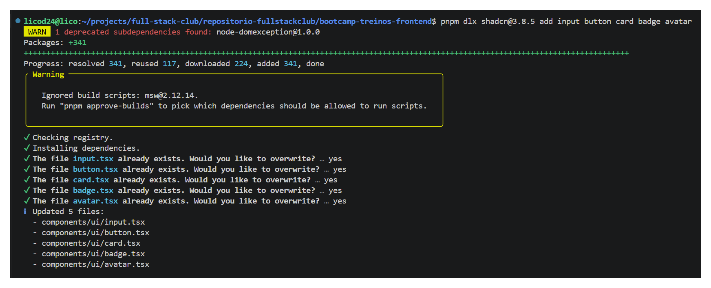

### Theming Shadcn

> https://ui.shadcn.com/docs/theming

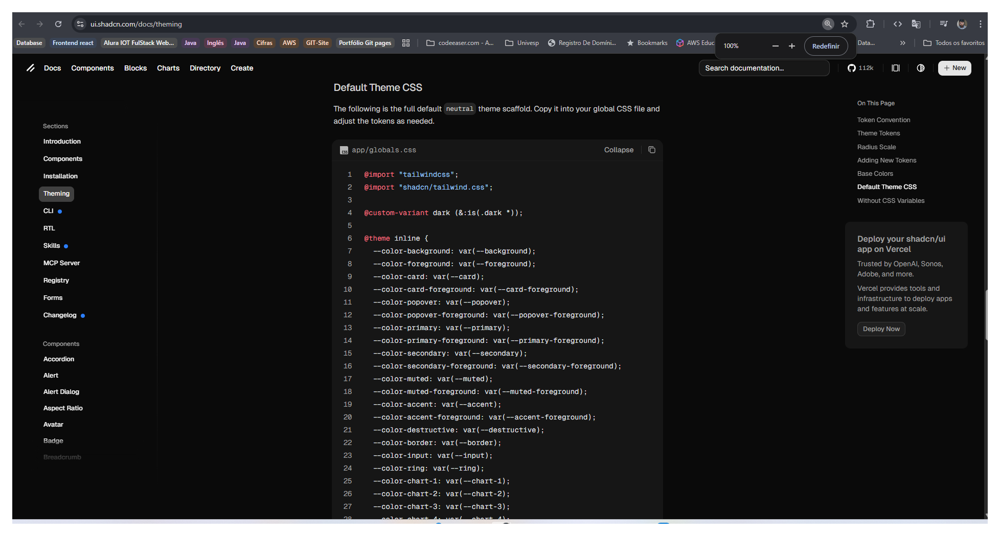

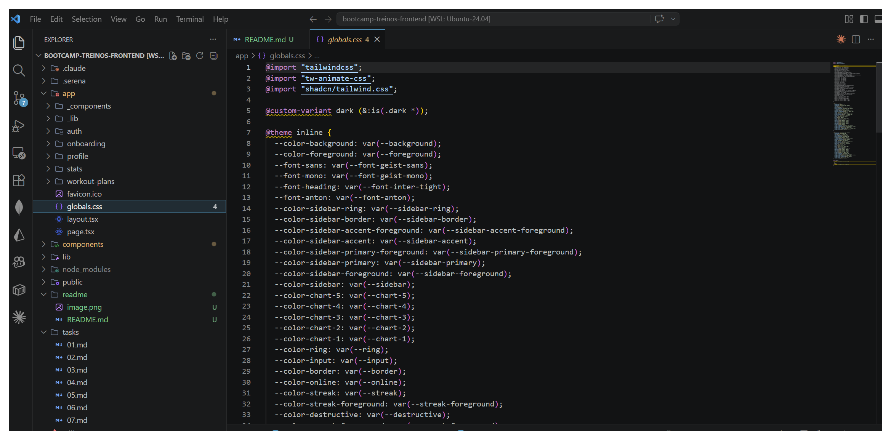

## Tanstack query

> https://tanstack.com/query/v5/docs/framework/react/installation

## Google Developer Console

> https://console.cloud.google.com/apis/dashboard?project=projeto-de-mapas-276823

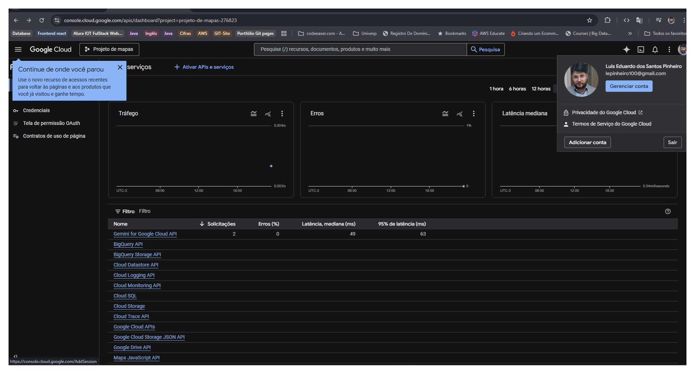

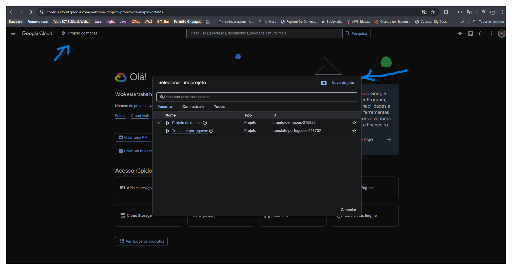

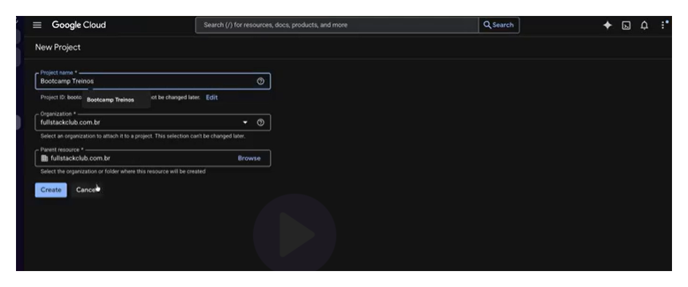

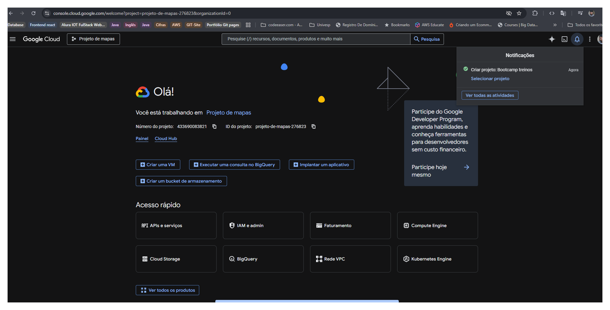

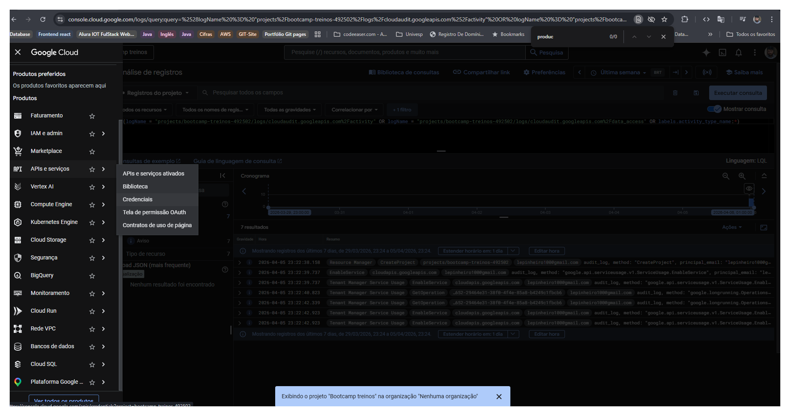

- Configurar tela de consentimentos

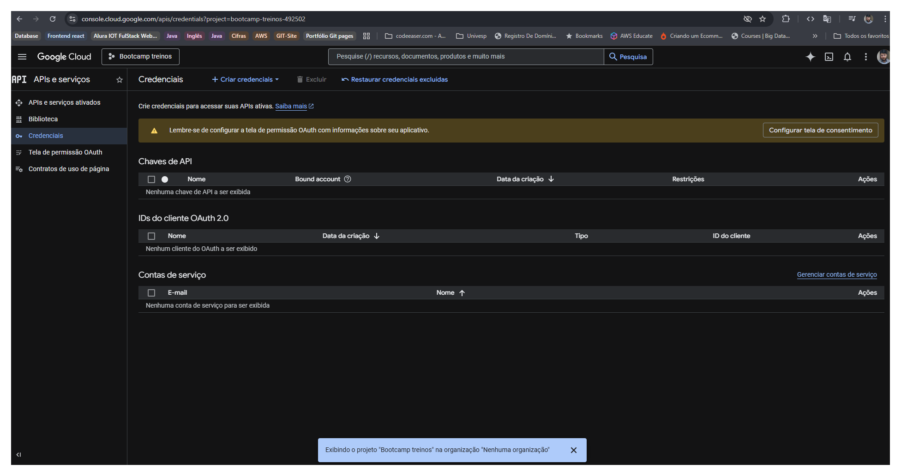

- Get start (Vamos começar)

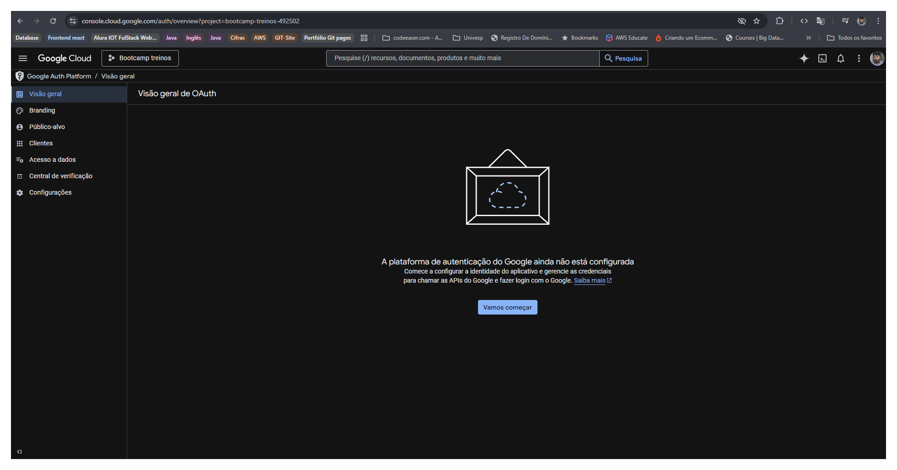

- Avançar

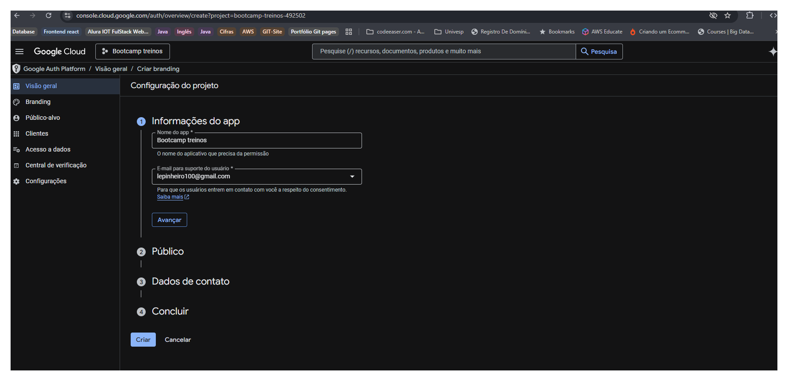

- Externo

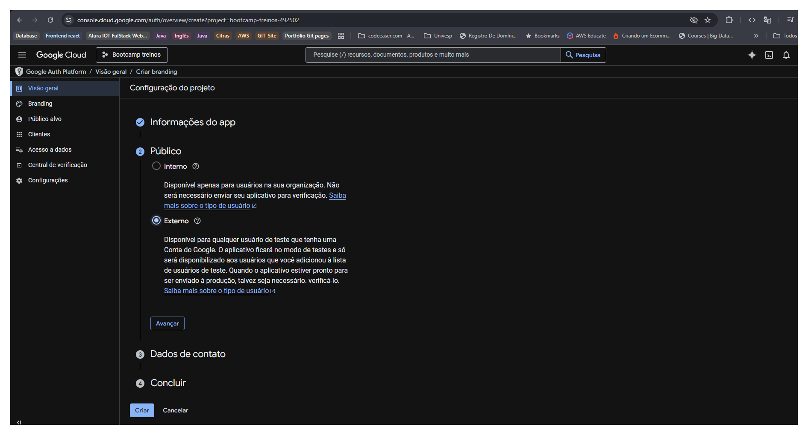

- Criar

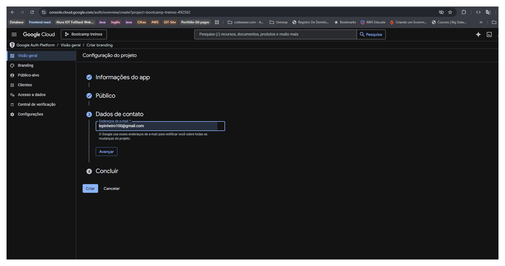

Criar um cliente OAuth

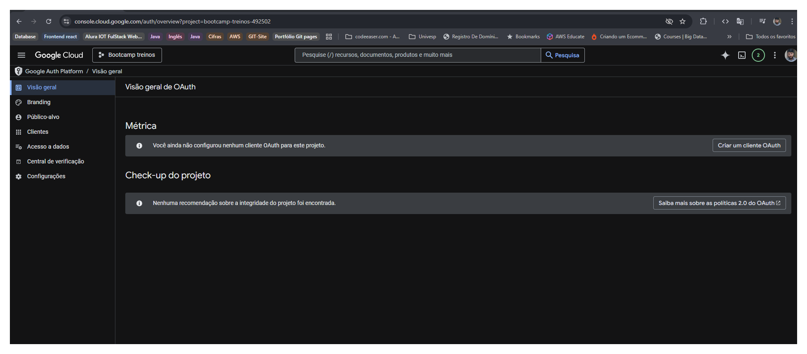

## Better-Auth

> https://better-auth.com/docs/authentication/google

inserir link: `http://localhost:3000/api/auth/callback/google`

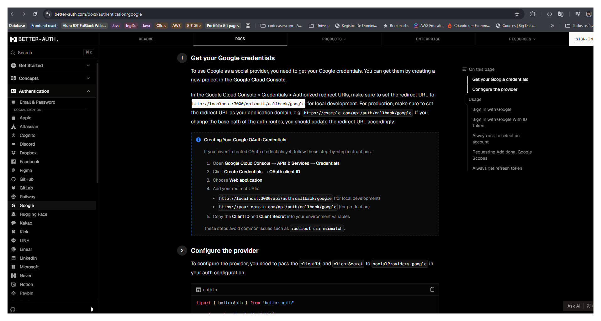

- Voltar no Console do Google e inserir a url acima

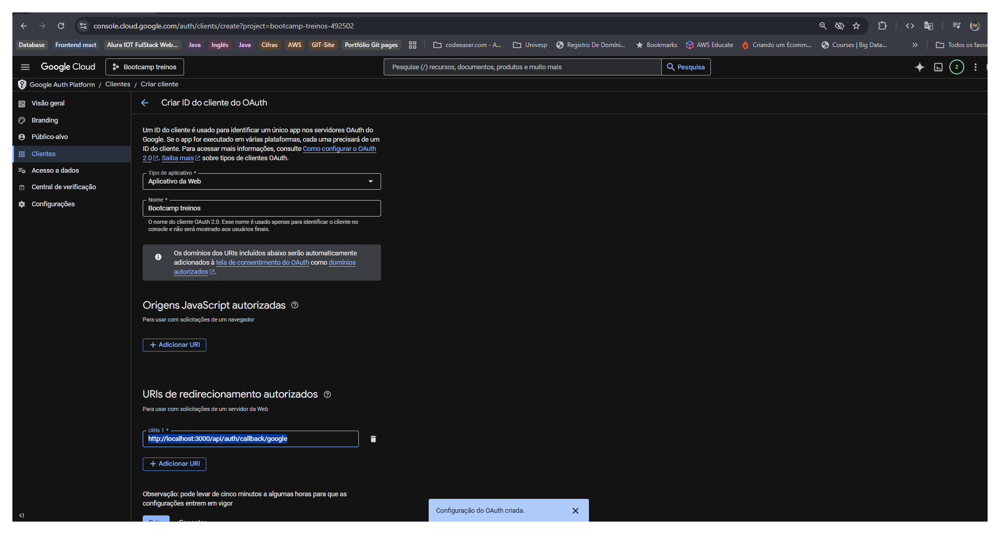


<mark> Erro </mark>

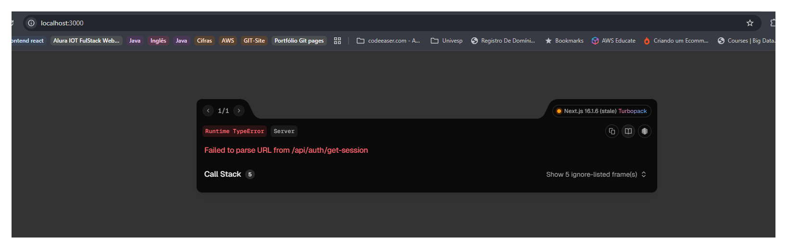


### Figma

## Tasks

### 01.md

### 02.md

### 03.md

### 04.md

### 05.md

### 06.md

### 07.md

